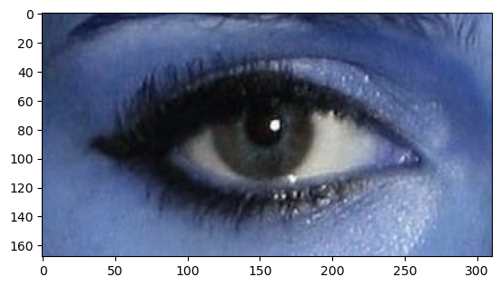

# Eye-cataract
This repository is dedicated to advancing the field of ophthalmology by developing innovative AI-driven solutions for the detection and analysis of eye cataracts, a common vision impairment affecting millions worldwide. By leveraging deep learning and computer vision, this project aims to assist healthcare professionals in early detection, improving diagnosis accuracy, and reducing the need for invasive procedures.

🔥 Key Features

✅ AI-Based Cataract Detection – Uses deep learning models to analyze eye images.

✅ Early Diagnosis – Identifies cataracts at an early stage for timely intervention.

✅ Medical Image Processing – Supports fundus and slit-lamp images for precise analysis.

✅ User-Friendly Interface – (Optional) Web-based or mobile integration for accessibility.

✅ High Accuracy – Trained on a diverse dataset for robust performance.

🛠 Technologies Used

1. Python, OpenCV, TensorFlow / PyTorch

2. Convolutional Neural Networks (CNNs) for image classification

3. NumPy, Pandas for data preprocessing

4. Matplotlib, Seaborn for visualization

🛠 Installation & Usage

1️⃣ Clone the Repository

-> git clone https://github.com/yourusername/CataractDetection.git

-> cd CataractDetection

2️⃣ Open Jupyter Notebook

Make sure you have Jupyter Notebook installed. If not, install it using:

-> pip install jupyterlab

Then start Jupyter Lab:

-> jupyter lab

3️⃣ Run the Notebook

1. Open Untitled.ipynb in Jupyter Lab.
   
3. Install all required dependencies inside the notebook:

-> !pip install -r requirements.txt

Run all cells in Untitled.ipynb to execute the model.

📌 Future Enhancements

🚀 Explainable AI (XAI) for better model interpretability

🚀 Mobile App Integration for on-the-go diagnosis

🚀 Multi-Disease Detection – Extend to glaucoma & diabetic retinopathy
